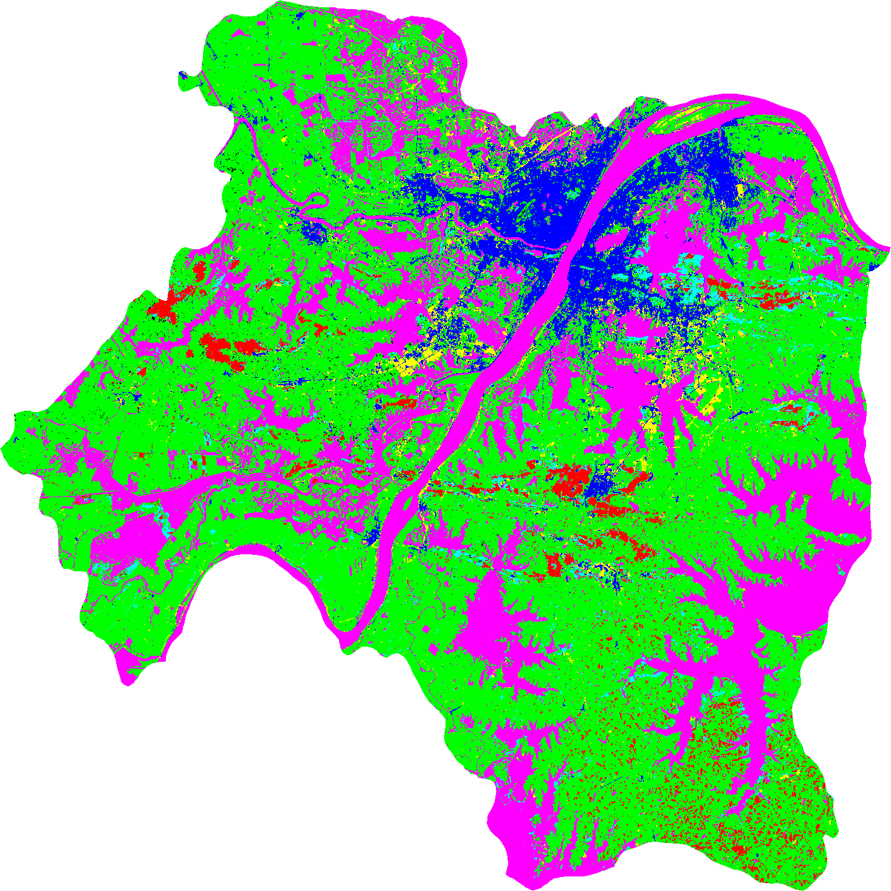
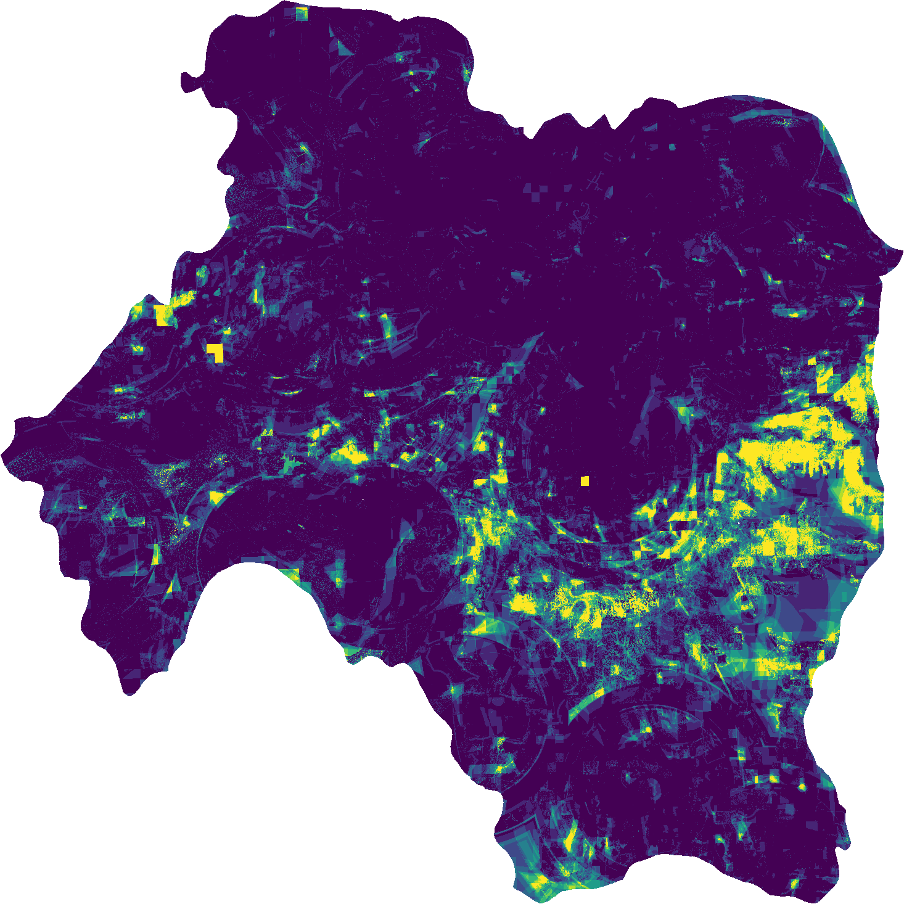
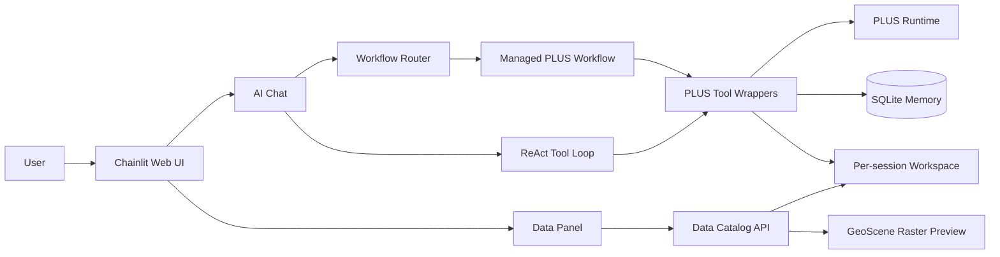
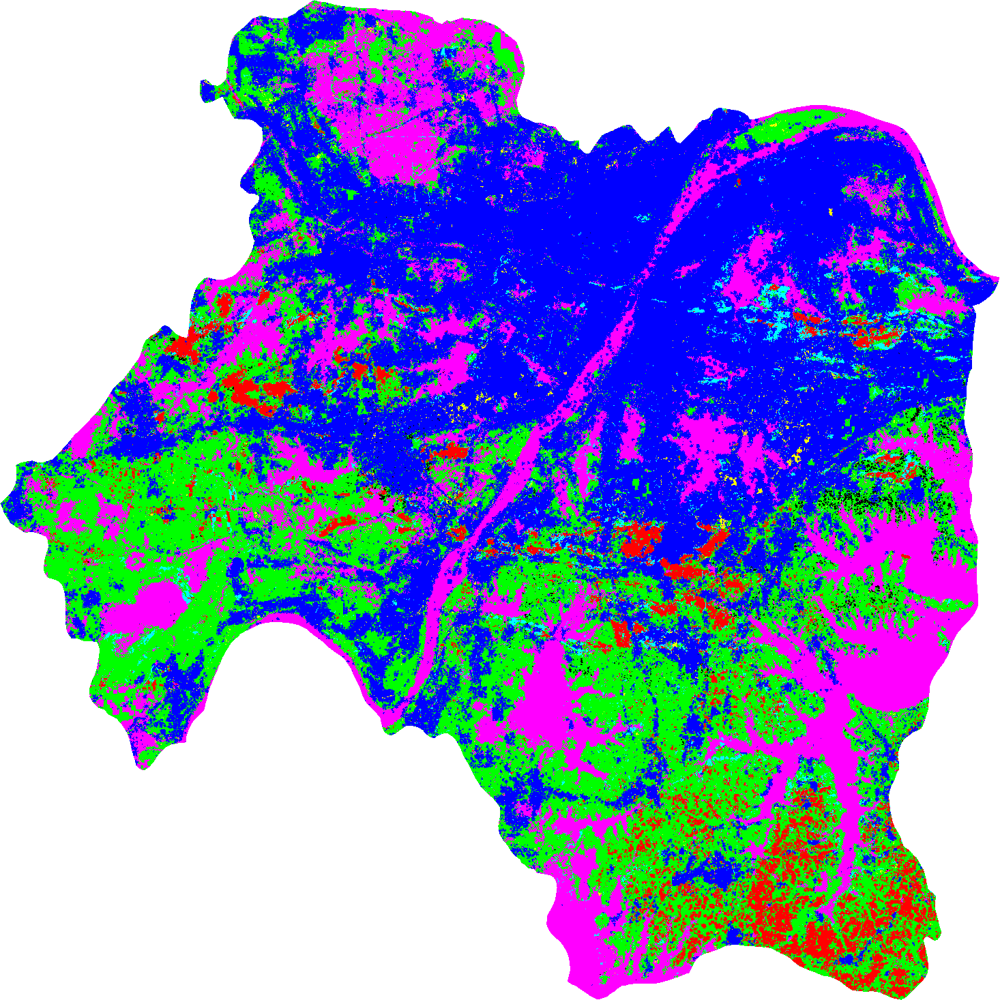

# PLUS Agent

AI-assisted land use simulation system built around the PLUS model, Chainlit, and GeoScene.

PLUS Agent turns a specialist PLUS workflow into an interactive assistant: users can upload raster data, ask questions in natural language, inspect tool parameters before execution, and view raster/CSV outputs inside a web interface.



## Why Build This

The PLUS model is powerful for land use simulation, but a complete run normally asks users to understand several tightly-coupled modules, prepare strict file paths, edit temporary parameters, launch batch scripts, and inspect scattered outputs. That workflow is manageable for experienced GIS users, but it is hard for newcomers, students, planners, or researchers who only run simulations occasionally.

PLUS Agent adds an AI operation layer on top of the professional model:

- It explains the modeling process in natural language.
- It routes complete simulation requests into a managed workflow.
- It generates default parameters and lets the user confirm or edit every step.
- It keeps uploaded data and outputs isolated by user and conversation.
- It renders GeoScene raster previews and CSV summaries directly in the chat UI.

The goal is not to replace professional modeling judgment. The goal is to make the professional workflow easier to start, easier to inspect, and harder to misuse.

## Feature Highlights

- AI chat interface for PLUS modeling questions and task guidance.
- Managed workflow for `convert -> expansion -> leas -> markov -> neighborhood_weight -> cars`.
- Parameter confirmation before each PLUS tool executes.
- GeoScene-based map panel for `.tif`/`.tiff` outputs.
- CSV preview with statistics and table rows.
- Local registration/login for multi-user and multi-session isolation.
- Memory store for summaries, workflow artifacts, and resumed conversations.
- OpenAI-compatible LLM backends: Claude, OpenAI, DeepSeek, and Qwen.
- Repository self-check script for GitHub release hygiene.



## System Overview



## Screenshots

| Raster upload preview | LEAS probability output | CARS simulation output |
| --- | --- | --- |
|  |  |  |

## Repository Contents

```text
agent/                 Chainlit app, LLM adapters, workflow runner, tools, memory
public/                Custom frontend assets for auth and data panel
tests/                 Unit tests and release-readiness checks
scripts/               Evaluation, packaging, and repository maintenance scripts
docs/                  Installation, architecture, privacy, and visual assets
plus-backend/          PLUS backend source and wrapper scripts
```

Third-party PLUS executables, DLLs, generated simulation outputs, local databases, uploaded workspaces, and private `.env` files are intentionally excluded from Git.

## Quick Start

### 1. Clone

```powershell
git clone https://github.com/chencure02/PLUS_Agent.git
cd PLUS_Agent
```

Keep the project path ASCII-only when you plan to run the PLUS backend, for example:

```text
C:\GIS\PLUS_Agent
```

Avoid Chinese characters or spaces in the path that is passed to the PLUS runtime.

### 2. Create Environment

Windows:

```powershell
.\setup.bat
conda activate plus-agent
```

Manual installation:

```powershell
conda create -n plus-agent python=3.11 -y
conda activate plus-agent
conda install -c conda-forge gdal -y
python -m pip install -r requirements.txt
```

### 3. Configure Keys

Copy the example file:

```powershell
copy .env.example .env
```

Then either fill an API key in `.env`, or leave `.env` empty and enter the key in the Chainlit settings panel after login.

### 4. Prepare PLUS Runtime

This repository does not publish third-party PLUS binaries or DLLs. Place the required official PLUS runtime files under:

```text
plus-backend\cpp\
```

At minimum, the runtime used by the wrapper scripts must be available locally, including `PLUS.exe` and its required DLLs. See [Installation Guide](docs/installation.md) for details.

### 5. Run

```powershell
chainlit run agent/main.py --host 0.0.0.0 --port 8000
```

Open:

```text
http://localhost:8000
```

On the login page, choose `注册账号`, create a local account, then log in.

## Common Workflow

1. Upload two LULC rasters and optional driving factors.
2. Ask the assistant to run a standard PLUS simulation.
3. Review and confirm parameters before each tool.
4. Inspect generated rasters and CSV outputs in the data panel.
5. Resume the conversation later from Chainlit history.


## Privacy Notes

This app is designed for local research and teaching demos by default. API keys, Chainlit databases, uploaded data, generated outputs, memory databases, and preview caches are ignored by Git. Read [Privacy and Data Policy](docs/privacy.md) before publishing forks or deploying the system to a server.

## Development Checks

```powershell
python -m unittest discover -s tests -v
python -m compileall agent tests scripts
python scripts/check_release_readiness.py
```

## License

The project code is released under the MIT License. Third-party software, the PLUS model runtime, GeoScene SDK, data samples, and external dependencies keep their own licenses.
