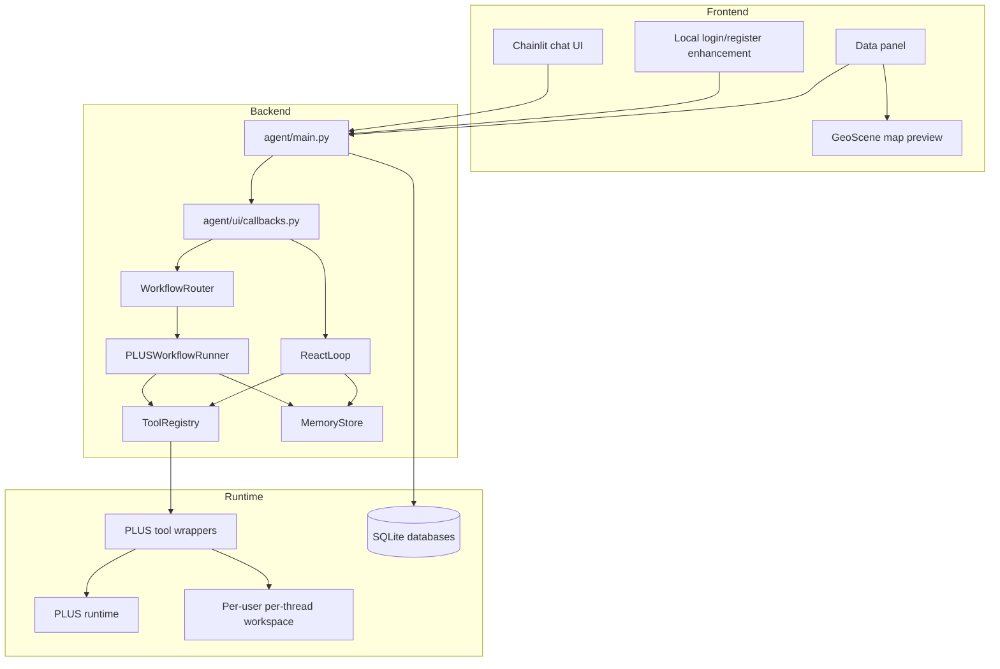

# Architecture

PLUS Agent is organized around a local Chainlit web app, an AI orchestration layer, PLUS tool wrappers, and a per-user workspace.

## Major Components



## Conversation Isolation

Each login user receives a workspace under:

```text
workspaces/<user>/threads/<thread>/
```

Uploads, derived files, and outputs are scoped to the Chainlit thread. The data panel calls backend catalog APIs with the current thread id, so a new conversation does not show another conversation's files.

## Workflow Routing

Requests for a complete or standard PLUS simulation are routed into the managed workflow:

```text
convert -> expansion -> leas -> markov -> neighborhood_weight -> cars
```

The runner prepares default parameters, asks the user to confirm or edit them, executes one module, records structured artifacts, and passes verified outputs to later modules.

Ordinary questions, file browsing, and one-off module calls still use the ReAct loop.

## Data Visualization

The data catalog endpoint lists current-thread files. Raster files are converted into preview images and geographic bounds, then rendered in the frontend with GeoScene `MediaLayer`. CSV files are summarized as rows and numeric statistics.

## Memory

The memory layer stores:

- conversation summaries
- workflow state
- workflow artifacts
- scoped user preferences

Runtime SQLite databases are local state and should not be committed.
